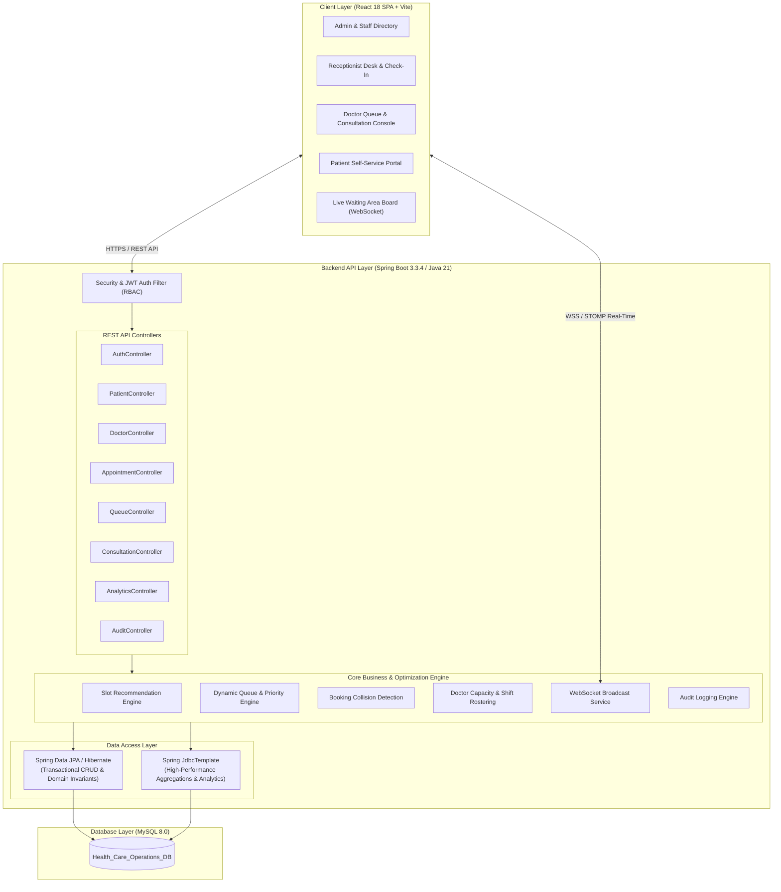

# 🏥 Healthcare Appointment Capacity & Queue Management Platform

[](https://www.oracle.com/java/)
[](https://spring.io/projects/spring-boot)
[](https://reactjs.org/)
[](https://vitejs.dev/)
[](https://www.mysql.com/)
[](https://spring.io/guides/gs/messaging-stomp-websocket/)
[](LICENSE)

An enterprise-grade, full-stack hospital operations and capacity planning platform designed to streamline outpatient department (OPD) workflows, eliminate doctor double-booking, manage real-time dynamic queue prioritization with WebSockets, and provide operational intelligence through dual JPA + JDBC aggregation.

---

## 📌 Table of Contents
- [Core Features](#-core-features)
- [System Architecture](#-system-architecture)
- [Technology Stack](#-technology-stack)
- [Project Directory Structure](#-project-directory-structure)
- [Database Setup & Schema](#-database-setup--schema)
- [Getting Started](#-getting-started)
  - [Prerequisites](#prerequisites)
  - [1. Database Configuration](#1-database-configuration)
  - [2. Backend Setup (Spring Boot)](#2-backend-setup-spring-boot)
  - [3. Frontend Setup (React + Vite)](#3-frontend-setup-react--vite)
- [Demo Credentials](#-demo-credentials)
- [Key API Endpoints](#-key-api-endpoints)
- [Data Validation & Security](#-data-validation--security)

---

## ✨ Core Features

### 1. 🔐 Role-Based Access Control (RBAC) & Authentication
* Granular access tailored for **5 distinct roles**: `ADMIN`, `DOCTOR`, `RECEPTIONIST`, `MANAGER`, and `PATIENT`.
* Stateless JWT authentication with secure password hashing (`BCrypt`).
* Patient self-registration with automatic credential and medical identifier (`PAT-XXXXXX`) generation.

### 2. 👨‍⚕️ Physician Lifecycle & Capacity Rostering
* **Physician Onboarding & Departure:** Register new doctors with specialization, room numbers, and fee structures. When a physician leaves the hospital, the system allows one-click deactivation/dropping while preserving past clinical and audit records.
* **Shift Scheduling:** Custom morning, evening, and full-day shift configurations with designated lunch/break windows.
* **Planned Leave Management:** Doctor leave requests automatically lock appointment booking slots for specified dates and session types (`FULL_DAY`, `FIRST_HALF`, `SECOND_HALF`).

### 3. 📅 Collision-Free Appointment Booking Engine
* **Dynamic Slot Recommendations:** Calculates real-time slot availability based on operating hours, scheduled leaves, and duration rules.
* **Double-Booking Prevention:** High-concurrency collision detection prevents overlapping appointments for physicians.
* **Full Lifecycle Management:** Seamless support for booking, rescheduling, status tracking (`SCHEDULED`, `IN_CONSULTATION`, `COMPLETED`, `CANCELLED`), and automated history logs.

### 4. ⏱️ Real-Time Queue & Dynamic Priority Engine
* **Smart Token Generation:** Automatic token issuance (e.g., `D1-001`) with doctor-specific counters.
* **Triage Prioritization:** Dynamically re-orders patients based on priority categories:
  * `EMERGENCY` (Priority Weight: 100)
  * `SENIOR_CITIZEN` (Priority Weight: 50)
  * `SCHEDULED_STANDARD` (Priority Weight: 10)
* **WebSocket Live Sync:** Real-time STOMP over WebSocket broadcasts queue events (`/topic/queue` and `/topic/queue/doctor/{id}`) across reception, doctor desks, and waiting room display boards without browser reloads.

### 5. 🩺 Clinical Consultations & E-Prescriptions
* Doctor consultation console with diagnosis, symptoms, clinical notes, and itemized prescriptions (drug name, dosage, frequency, duration, intake instructions).
* Digital consultation history linked to patient medical profiles.

### 6. 📊 Operational Intelligence & Analytics
* **Dual JPA + JDBC Approach:** Standard transactions utilize **Spring Data JPA**, while compute-heavy operational summaries and utilization metrics utilize high-performance **Spring JdbcTemplate** queries.
* Real-time metrics on doctor utilization percentages, average wait times, patient throughput, and department volume.

### 7. 🛡️ Regulatory Audit Trail
* Non-repudiation audit logging tracking user identity, action type (`CREATE`, `UPDATE`, `DEACTIVATE`, `LOGIN`), entity ID, client IP address, and timestamps.

---

## 🏛️ System Architecture



---

## 💻 Technology Stack

| Layer | Technology | Purpose |
| :--- | :--- | :--- |
| **Frontend** | React 18, Vite | Single Page Application framework and build tool |
| **Styling** | TailwindCSS, Lucide Icons | Responsive UI and modern design system |
| **Backend** | Spring Boot 3.3.4, Java 21 | Enterprise REST API and business logic |
| **Security** | Spring Security, JJWT (0.12.6) | Stateless token authentication and RBAC |
| **Real-Time** | Spring WebSocket, STOMP, SockJS | Real-time queue event push |
| **ORM / Data Access** | Spring Data JPA (Hibernate), Spring JDBC | Relational data mapping & aggregated queries |
| **Database** | MySQL 8.0 | Relational database storage |
| **Validation** | Jakarta Bean Validation (`@Valid`) | Multi-tier input verification |

---

## 📂 Project Directory Structure

```
HealthcareOperations/
├── backend/
│   └── health_care_operations/
│       ├── pom.xml                                    # Maven Dependencies & Configuration
│       └── src/main/java/com/healthcare/
│           ├── config/                                # WebSocket & Security Configurations
│           ├── controller/                            # REST API Controllers (10 Controllers)
│           ├── dto/                                   # Data Transfer Objects & Requests/Responses
│           ├── entity/                                # JPA Entities (User, Doctor, Appointment, etc.)
│           ├── repository/                            # JPA Repositories & JDBC Analytics Repository
│           ├── security/                              # JWT Filter, Token Provider & UserDetails
│           └── service/                               # Business Logic & Capacity Engines
├── frontend/
│   ├── package.json                                   # NPM Scripts & Dependencies
│   ├── vite.config.js                                 # Vite Build & Proxy Configuration
│   └── src/
│       ├── components/                                # Reusable UI (Modals, Badges, Loaders)
│       ├── context/                                   # AuthContext & Session State
│       ├── hooks/                                     # Custom WebSocket Hook (useQueueWebSocket)
│       ├── pages/                                     # Application Views (Dashboard, Queue, Doctors, etc.)
│       └── services/                                  # Axios API Connectors
├── database/
│   ├── schema.sql                                     # DDL Table Schemas & Foreign Keys
│   └── seed_data.sql                                  # Pre-populated Demo Data & Default Accounts
└── documentation/                                     # Architecture & Milestone Specs
```

---

## 🗄️ Database Setup & Schema

The platform database consists of 12 normalized tables:
* `roles` & `users` — Authentication, RBAC, and profiles
* `departments` & `doctors` — Department structures and physician credentials
* `doctor_availability` & `doctor_leaves` — Weekly shifts, break hours, and time off
* `patients` — Patient records, blood groups, and emergency contacts
* `appointment_types`, `appointments`, `appointment_history` — Scheduling and audit states
* `priority_rules` & `queue_entries` — Dynamic priority weights and live tokens
* `consultations` & `prescription_items` — Clinical notes and digital prescriptions
* `audit_logs` — System event logs

---

## 🚀 Getting Started

### Prerequisites
* **Java Development Kit (JDK):** Version 21 or higher
* **Node.js:** Version 18.x or higher
* **MySQL Server:** Version 8.0 or higher
* **Apache Maven:** Version 3.8+ (or use included `mvnw`)

---

### 1. Database Configuration
1. Start your MySQL service.
2. Log in to MySQL and initialize the schema and seed data:
   ```sql
   mysql -u root -p < database/schema.sql
   mysql -u root -p < database/seed_data.sql
   ```
3. Update backend database credentials in `backend/health_care_operations/src/main/resources/application.properties`:
   ```properties
   spring.datasource.url=jdbc:mysql://localhost:3306/Health_Care_Operations_DB?useSSL=false&serverTimezone=UTC&allowPublicKeyRetrieval=true
   spring.datasource.username=root
   spring.datasource.password=YOUR_MYSQL_PASSWORD
   server.port=8081
   ```

---

### 2. Backend Setup (Spring Boot)
1. Navigate to the backend directory:
   ```bash
   cd backend/health_care_operations
   ```
2. Build and run the application:
   ```bash
   mvn clean spring-boot:run
   ```
   *The backend REST API and WebSocket server will start on `http://localhost:8081`.*

---

### 3. Frontend Setup (React + Vite)
1. Navigate to the frontend directory:
   ```bash
   cd frontend
   ```
2. Install dependencies:
   ```bash
   npm install
   ```
3. Launch the development server:
   ```bash
   npm run dev
   ```
   *The application will be accessible at `http://localhost:5173`.*

---

## 🔑 Demo Credentials

All test accounts are pre-seeded with the password: `Password@123` (or role-specific shortcuts listed below):

| Role | Username | Default Password | Primary Dashboard Access |
| :--- | :--- | :--- | :--- |
| **ADMIN** | `admin` | `admin123` | Full Access, Staff Management, Audit Trail |
| **DOCTOR** | `dr.sharma` | `doctor123` | Queue Console, Consultation, Schedule Settings |
| **DOCTOR** | `dr.patel` | `doctor123` | Queue Console, Consultation, Schedule Settings |
| **RECEPTIONIST** | `reception1` | `reception123` | Patient Registration, Check-In, Booking Desk |
| **MANAGER** | `manager1` | `manager123` | Capacity Analytics, Doctor Utilization Reports |
| **PATIENT** | `patient1` | `patient123` | Appointment Booking, Live Token View |

---

## 📡 Key API Endpoints

### Authentication
* `POST /api/v1/auth/login` — Authenticate and receive JWT Bearer token
* `POST /api/v1/auth/register` — Patient self-registration

### Doctors & Rostering
* `GET /api/v1/doctors` — List all physicians (optional `departmentId` filter)
* `POST /api/v1/doctors` — Register a new physician
* `DELETE /api/v1/doctors/{id}` — Deactivate / drop physician upon leaving hospital
* `POST /api/v1/doctors/{id}/availability` — Configure weekly shift timings
* `POST /api/v1/doctors/leave` — Submit doctor planned leave

### Appointments & Slots
* `GET /api/v1/appointments/available-slots` — Calculate available consultation slots
* `POST /api/v1/appointments` — Book a confirmed appointment
* `PUT /api/v1/appointments/{id}/reschedule` — Reschedule appointment date/time
* `PUT /api/v1/appointments/{id}/cancel` — Cancel appointment

### Real-Time Queue (WebSocket + REST)
* `POST /api/v1/queue/check-in` — Check in patient and generate token
* `POST /api/v1/queue/doctor/{doctorId}/call-next` — Call next priority patient
* `PUT /api/v1/queue/{id}/complete` — Conclude consultation
* `WS /ws` ➔ Subscription topic: `/topic/queue`

### Clinical Consultations
* `POST /api/v1/consultations` — Save clinical diagnosis and digital e-prescription
* `GET /api/v1/consultations/appointment/{id}` — Retrieve consultation details

### Analytics & Audit
* `GET /api/v1/analytics/live-queue-summary` — Real-time queue metrics
* `GET /api/v1/analytics/doctor-utilization` — Doctor capacity vs booked ratios
* `GET /api/v1/audit-logs` — Fetch compliance audit logs

---

## 🛡️ Data Validation & Security
* **Client-Side:** Input sanitization, password constraints, and dynamic form validation.
* **REST API Layer:** `@Valid` and `@RestControllerAdvice` in `GlobalExceptionHandler` returning structured field error maps.
* **Service Layer:** Unique constraints check (`username`, `email`, `phone`), entity existence validation, and doctor slot collision detection.
* **Database Layer:** Foreign key cascades, `NOT NULL`, and `UNIQUE` indexes.

---

## 📄 License
This project is open source and available under the [MIT License](LICENSE).
